# Flashcards

An open-source Android app for learning any language with spaced repetition.

Type or paste a phrase and the app translates it, speaks it aloud and, for scripts like Arabic, Persian, Japanese or Thai, writes how it sounds in Latin letters. Review with swipes, watch your cards climb the Leitner boxes, and keep your week free of ice cubes 🧊.

It is meant as a **starting point**: small, readable, no dependency-injection framework, and every outside service sits behind a small client class you can swap for your own.

**Try it:** download the APK from the [latest release](https://github.com/Mohfath/FlashCardPro/releases/latest), install it, and add your own keys in Settings. It is a preview build, signed with the standard Android debug key.

## Screenshots

<table>
  <tr>
    <td align="center">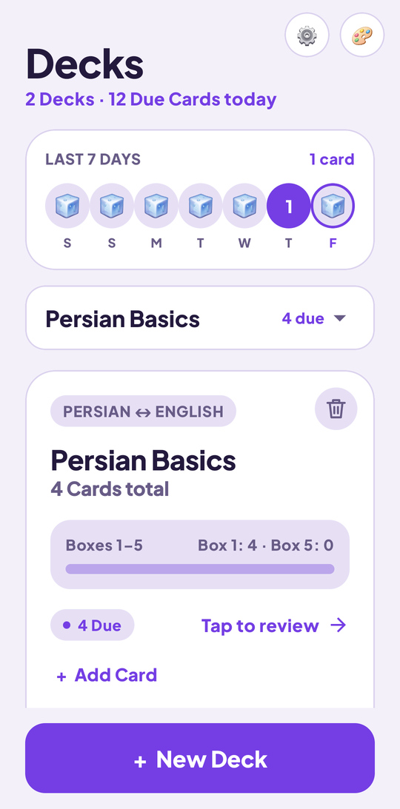<br><sub>Decks and your last 7 days</sub></td>
    <td align="center">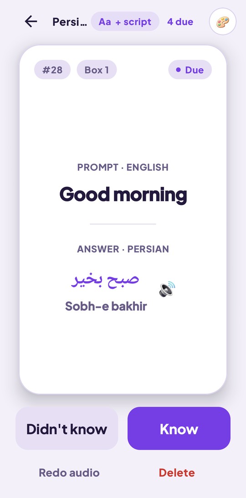<br><sub>Review: script plus Latin letters</sub></td>
    <td align="center">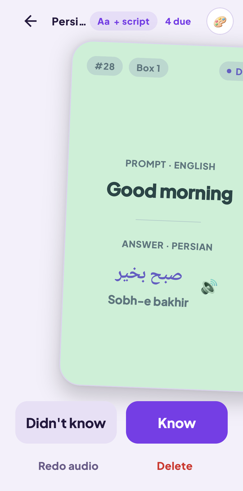<br><sub>Swipe right: know it</sub></td>
  </tr>
  <tr>
    <td align="center">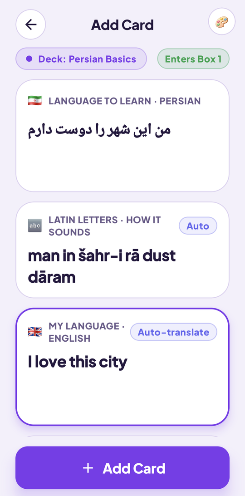<br><sub>Type once, the rest fills in</sub></td>
    <td align="center">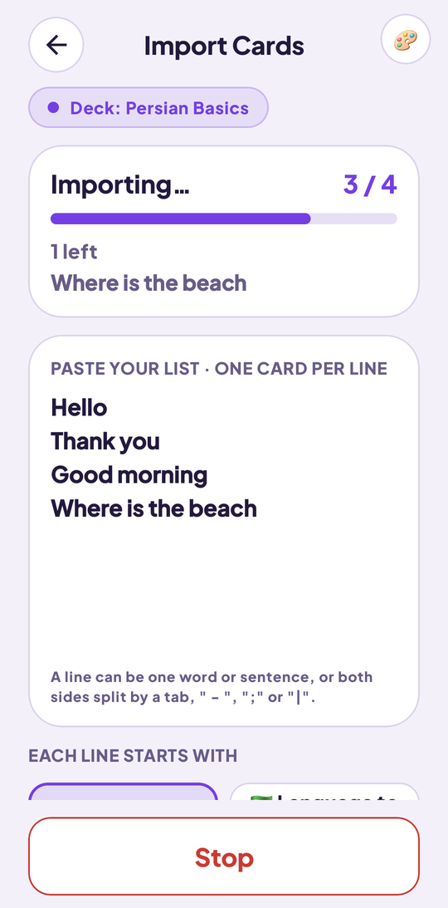<br><sub>Paste a list, watch the counter</sub></td>
    <td align="center">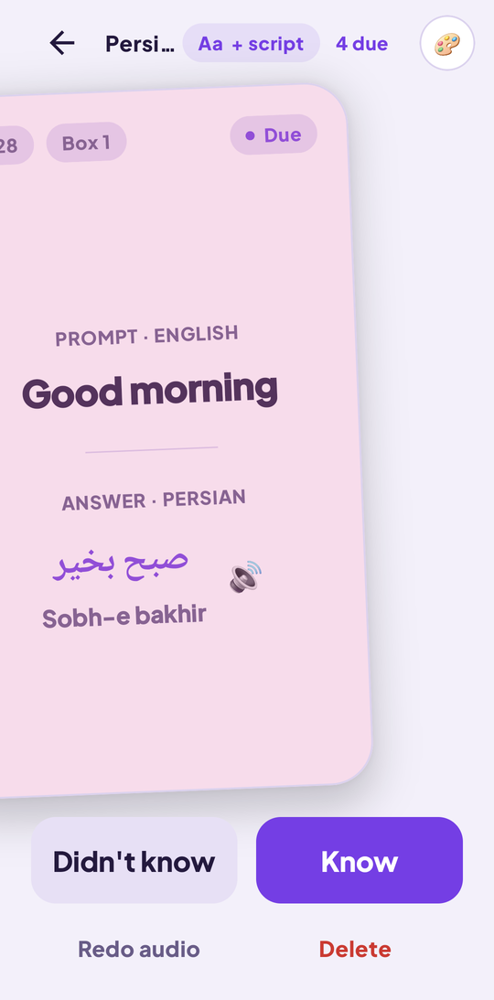<br><sub>Swipe left: not yet</sub></td>
  </tr>
  <tr>
    <td align="center">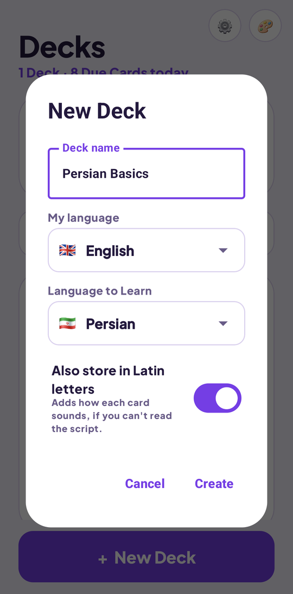<br><sub>New deck, 27 languages</sub></td>
    <td align="center">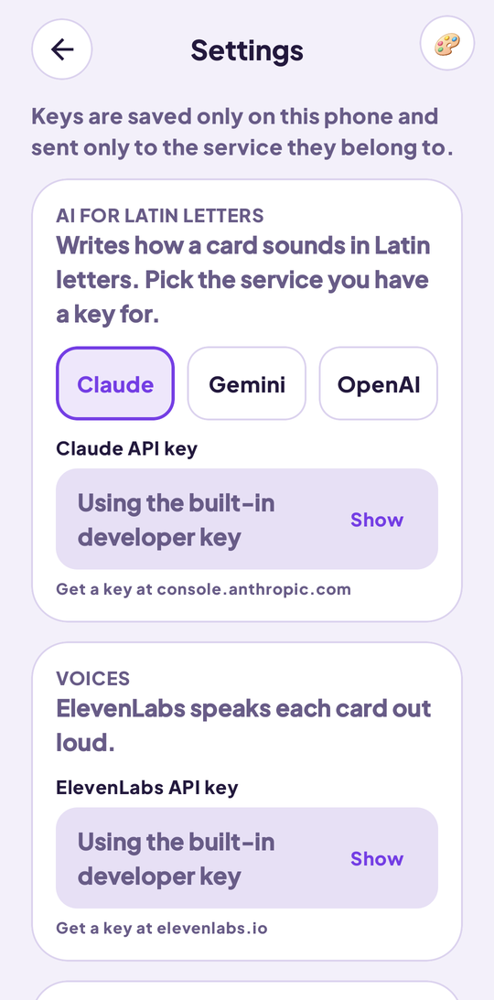<br><sub>Bring your own API keys</sub></td>
    <td align="center">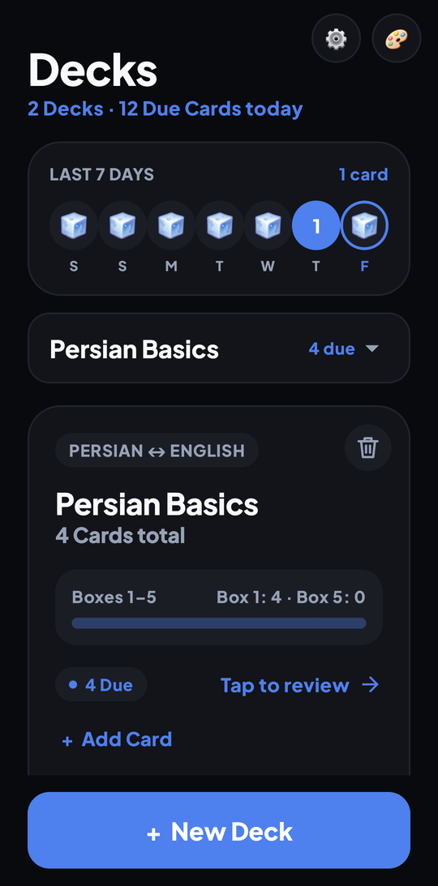<br><sub>Six themes (Midnight shown)</sub></td>
  </tr>
</table>

## On your phone and in your car (Android Auto)

Flashcards runs as an ordinary Android app and also as a media app on the **Android Auto** screen, so you can review hands-free while driving: the card is read aloud, play reveals the answer, and the ✓ and ✗ buttons (or the steering-wheel next and previous keys) mark it known or not yet. The card art is coloured by Leitner box, from red in Box 1 to green in Box 5, with the language flag, cards left and a five-step box bar. The screenshots below come from Google's Android Auto Desktop Head Unit emulator.

<table>
  <tr>
    <td align="center">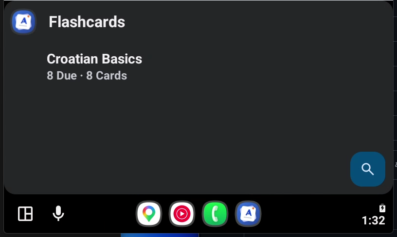<br><sub>Pick a deck</sub></td>
    <td align="center">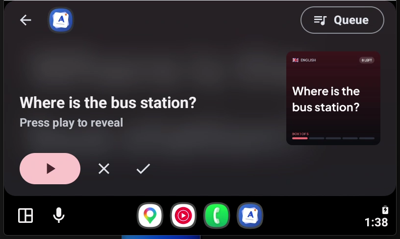<br><sub>Colour follows the Leitner box</sub></td>
    <td align="center">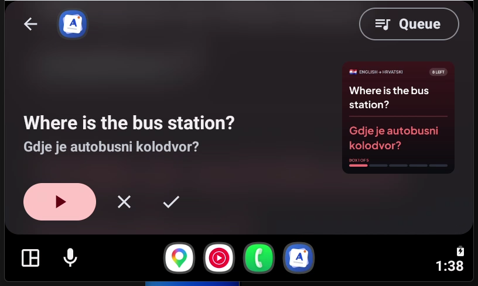<br><sub>Play reveals it; ✓ know, ✗ again</sub></td>
  </tr>
</table>

## Features

- **Decks for any language pair.** Choose from 27 languages with flags, in alphabetical order. Each deck has its own "my language" and "language to learn".
- **Leitner review.** Five boxes; cards you know move up, cards you miss go back to Box 1. Due cards come first, then optional extra practice.
- **Swipe to review.** Drag the card right for *Know*, left for *Didn't know*, down to delete. The card follows your finger and tints green, pink or blue.
- **Auto-translate.** Type in one language and the other fills in about a second later (DeepL).
- **Spoken audio.** Each card gets audio in the language you are learning (ElevenLabs). Tap the speaker to replay it. Audio is generated once and stored on the phone.
- **Latin-letter readings.** For non-Latin scripts, a deck can also store how each card sounds. Claude, Gemini or OpenAI write it, and you can switch the display between script and Latin letters while reviewing.
- **Batch import.** Paste a list, one card per line, or both sides split by a tab, ` - `, `;` or `|`. A live counter shows how many are done and how many are left.
- **Example sentences.** Optional per card, shown under the answer.
- **Last 7 days.** Seven circles show how many cards you answered each day. Days you skipped show an ice cube.
- **Six themes.** Daylight, Ocean, Forest, Sunset, Lavender and Midnight, chosen from a button in the top corner.
- **Android Auto.** Review from the car screen with the card read aloud and steering-wheel controls (Media3 media session). Because it is not distributed through the Play Store, turn on developer mode in Android Auto to see it.
- **Bring your own keys.** Learners enter their own API keys in Settings; they are stored only on the phone.

## Tech

| | |
|---|---|
| Language / UI | Kotlin, Jetpack Compose, Material 3 |
| Data | Room (SQLite), with migrations |
| Audio / car | Media3 session, Android Auto |
| Services | DeepL (translation), ElevenLabs (speech), Claude / Gemini / OpenAI (Latin letters) |
| Min / target SDK | 26 / 37 |

## Getting started

You need Android Studio (or a JDK 17+) and an Android phone or emulator.

1. Clone the repo and open it in Android Studio.
2. *(Optional, debug builds only.)* Put your keys in `local.properties` so you do not have to type them into the app:

   ```properties
   DEEPL_API_KEY=...
   ELEVENLABS_API_KEY=...
   ANTHROPIC_API_KEY=...
   ```

   `local.properties` is git-ignored. Never commit keys.
3. Run the app. Or from a terminal:

   ```bash
   ./gradlew assembleDebug
   ./gradlew testDebugUnitTest
   ```

4. Open **Settings** (⚙️ on the first screen) and add the keys you want to use. You only need the ones for the features you use:

   | Key | Used for | Where to get one |
   |---|---|---|
   | DeepL | Translating between your two languages | deepl.com/pro-api (free tier available) |
   | ElevenLabs | Spoken audio | elevenlabs.io |
   | Claude, Gemini or OpenAI | Latin-letter readings (only for decks that turn it on) | console.anthropic.com, aistudio.google.com, platform.openai.com |

Release builds contain no keys at all; every user supplies their own.

## Make it yours

The code is organised so common changes are small:

| I want to… | Look at |
|---|---|
| Add or remove languages | `Languages.kt` (one line per language; set `latin = false` for non-Latin scripts) |
| Change a colour theme | `Theme.kt` (`AppTheme` enum) |
| Change the review rules | `Leitner.kt`, `ReviewSession.kt` |
| Use a different translator | `DeepL.kt` (same `translate(text, from, to)` shape) |
| Use a different voice or model | `ElevenLabs.kt` (voice id, model, per-language model choice) |
| Change which AI model writes Latin letters | `AiClients.kt` (one model constant per provider) |
| Change the swipe feel or colours | `ReviewScreen.kt` |
| Change the database | `Entities.kt`, `Dao.kt` (bump the version and add a `Migration`) |
| Change the app icon | `res/drawable/ic_launcher_*.xml` |

## Project layout

```
app/src/main/java/com/matt/flashcard/
  MainActivity.kt          navigation between screens
  DeckListScreen.kt        first screen: week strip, deck picker, deck card
  ReviewScreen.kt          swipeable card, reveal, answer buttons
  AddCardScreen.kt         add one card (auto-translate, Latin letters, example)
  ImportScreen.kt          paste a list and import it with a live counter
  SettingsScreen.kt        API keys
  Leitner.kt, ReviewSession.kt   spaced-repetition rules
  Entities.kt, Dao.kt, Practice.kt   Room database
  DeepL.kt, ElevenLabs.kt, AiClients.kt   outside services
  FlashcardService.kt, ReviewPlayer.kt    Android Auto
app/src/test/              unit tests (rules, parsing, request building)
app/src/androidTest/       database and Android Auto tests
```

## Costs and privacy

- Translation, audio and Latin letters call paid or rate-limited services, so each uses the cheapest suitable model (for example Claude Haiku). Importing a long list makes one call of each kind per card.
- Your cards, audio and keys stay on your phone. Text is sent only to the services you set up, to translate or speak it.

## Third-party software and services

Built with Jetpack Compose, Room, Media3 and Kotlin (all Apache 2.0), the **Plus Jakarta Sans** font (SIL Open Font License 1.1), and four online services you use with your own keys: DeepL, ElevenLabs, and Claude, Gemini or OpenAI. The full list, with versions and licenses, is in [`THIRD_PARTY_NOTICES.md`](THIRD_PARTY_NOTICES.md).

## Known limits

- Not every language is supported by every service. Check that DeepL and ElevenLabs cover the languages you pick; Persian audio, for example, uses ElevenLabs' newer model.
- The Gemini and OpenAI paths follow the providers' docs but have had less real-world testing than the Claude one.
- Practice history starts when you update; earlier reviews are not counted.

## Contributing

Issues, discussions and pull requests are welcome. See [`CONTRIBUTING.md`](CONTRIBUTING.md) for how to run the tests and what to check first. Please keep changes small and add a unit test for new rules or parsing.

## License

MIT. See [`LICENSE`](LICENSE). Third-party libraries, the font and the online services keep their own terms; see [`THIRD_PARTY_NOTICES.md`](THIRD_PARTY_NOTICES.md).
